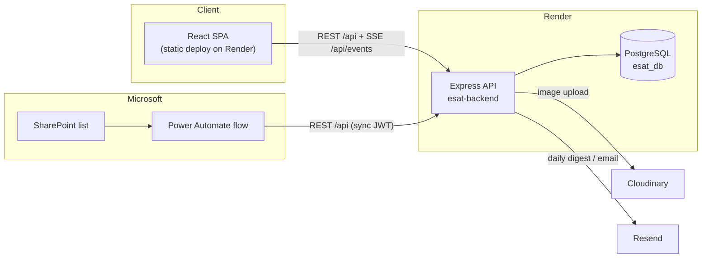

# 1. Overview & Architecture

## What ESAT is

**ESAT (Egypro Safety Audit Tracker)** is an internal web application for the
Egypro EHS (Environment, Health & Safety) team. It tracks:

- **Employees & casuals** and whether each needs a safety audit (SAN — "Safety
  Audit Needed").
- **Safety audits** — per-employee inspections of required PPE / tools, with a
  compliance result.
- **NCRs (Non-Conformance Reports)** — items flagged during audits (missing or
  not-good PPE) and their resolution lifecycle.
- **PPE / tool requests** — the procurement flow that resolves NCRs (EHS → PM →
  SCM → warehouse → distribution).
- **Reporting** — audit coverage, auditor performance, request trends, repeated
  requests, and a management dashboard.

## Stack

| Layer | Technology |
|-------|-----------|
| **Frontend** | React 18 (Create React App / `react-scripts`), React Router 6, Axios, Recharts (charts), jsPDF + html2canvas (PDF/CSV export) |
| **Backend** | Node.js + Express 4 (single `server.js`), PostgreSQL via `pg` |
| **Auth** | JWT (`jsonwebtoken`) + `bcrypt` password hashing |
| **Uploads** | `multer` → Cloudinary (audit photos / documents) |
| **Email** | Resend (daily digest + notifications) |
| **Hosting** | Render — backend web service + managed PostgreSQL; frontend as a separate static deployment |

## Repositories

| Repo | Contents | Path |
|------|----------|------|
| `Maged254/esat` | Backend (`server.js`), this `docs/`, `SECURITY.md` | `esat2/` locally |
| `Maged254/esat-frontend` | React SPA | `esat/frontend/` locally |

> ⚠️ Both repos are currently **public** — never commit secrets. See
> [`../SECURITY.md`](../SECURITY.md).

## High-level architecture

## How a request flows

1. A user signs in; the SPA stores a **JWT** and sends it as
   `Authorization: Bearer …` on every API call.
2. The Express `auth` middleware verifies the JWT, attaches `req.user`
   (id, role, and project/client/page access), and enforces scope.
3. Handlers query PostgreSQL and return JSON.
4. When employee data changes, the API broadcasts a **Server-Sent Event**
   (`/api/events`) so open SPA sessions refresh live instead of polling.

The **SharePoint → Power Automate** sync uses the same REST API (as the
`sync@egypro.com` account) — it never touches the database directly. See
[Integrations & Sync](07-integrations-and-sync.md).

## Backend at a glance

- **One file:** `server.js` (~3,700 lines) — ~79 `/api/*` routes.
- **Self-provisioning schema:** on boot, `setupDB()` runs `CREATE TABLE IF NOT
  EXISTS` plus idempotent `ALTER TABLE … ADD COLUMN IF NOT EXISTS` migrations, so
  a fresh database is brought up to the current schema automatically.
- **Session invalidation:** non-sync tokens issued before the server's boot time
  are rejected (everyone re-logs in after a deploy); the sync account is exempt.
- **Core tables:** `users`, `employees`, `casuals`, `audits`, `audit_items`,
  `ncr_items`, `ppe_items`, `ppe_requests`, `purchase_requests`,
  `purchase_request_items`, `employee_ppe_assignments`, `locations`,
  `request_logs`, `sync_log`. Detail in
  [Data Model & Statuses](05-data-model-and-statuses.md).

## Frontend at a glance

- **SPA** served statically; talks to the deployed API base
  (`…onrender.com/api`, configured in `src/utils/api.js`).
- **Routing/auth:** `App.jsx` defines routes; `AuthContext` holds the session and
  auto-logs-out after inactivity; a `PageGuard` enforces per-page access.
- **Layout:** `components/Layout.jsx` renders the sidebar (see
  [Navigation & Pages](03-navigation-and-pages.md)); shared look in
  `src/index.css` (see [Design System](02-design-system.md)).

## Environments

| | Backend | Frontend | Database |
|---|---------|----------|----------|
| **Local dev** | `node server.js` (port from `PORT`) | `npm start` (CRA dev server, port 3000) | Postgres via `DATABASE_URL` |
| **Production** | Render web service `esat-backend` | Render static deploy | Render PostgreSQL `esat_db` |

Environment variables and deploy steps: [Operations & Deployment](08-operations-and-deployment.md).
