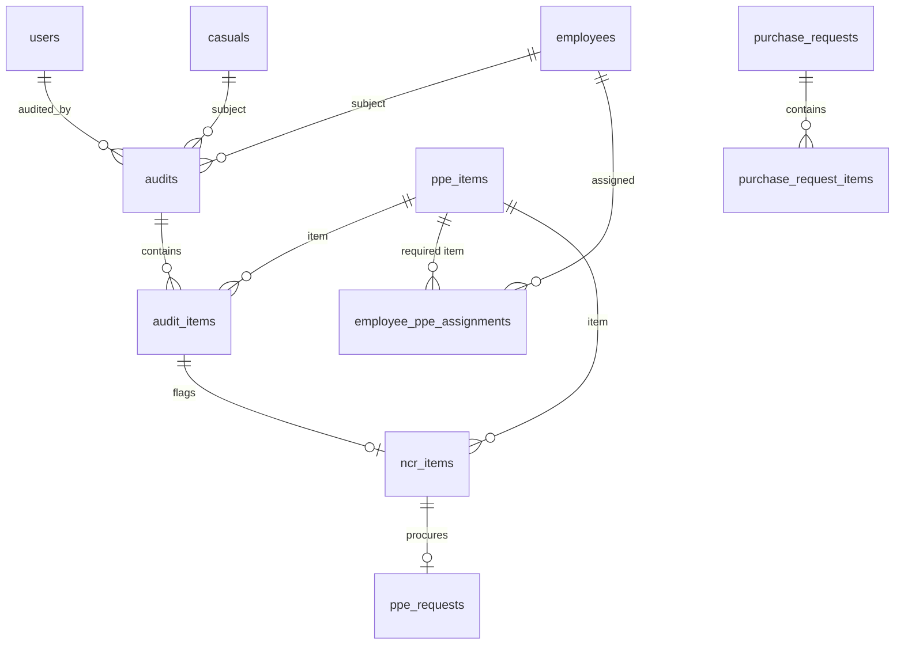

# 5. Data Model & Statuses

PostgreSQL schema is created and migrated by `setupDB()` in `server.js` on boot
(`CREATE TABLE IF NOT EXISTS` + idempotent `ALTER TABLE … ADD COLUMN IF NOT
EXISTS`). This doc describes the logical model and the status lifecycles; exact
columns live in `setupDB()`.

## Entity overview



## Core tables

| Table | Purpose | Key columns |
|-------|---------|-------------|
| `users` | App accounts | `role`, `is_active`, `page_access[]`, `project_access[]`, `client_access[]`, `must_reset_password`, lockout fields |
| `employees` | Permanent/outsourced staff | `employee_number`, `national_id`, `project`, `client`, `organization`, `resource_type`, `employment_status`, `exit_date`, `san` |
| `casuals` | Casual workers | Similar identity fields; referenced as `casual_id` across audits/NCR/requests |
| `ppe_items` | PPE/tool catalog | `category`, `has_size`, `size_type`, `needs_pda`, `sort_order`, `is_active` |
| `employee_ppe_assignments` | Which items an employee must have | `employee_id`, `ppe_item_id` |
| `audits` | One inspection | `employee_id`/`casual_id`, `audited_by`, `audit_date`, `overall_status`, `employee_present` |
| `audit_items` | Per-item result within an audit | `condition`, `size_value`, `quantity`, `comment` |
| `ncr_items` | Flagged non-conformances | `status`, links back to `audit_item_id`, `ppe_item_id` |
| `ppe_requests` | Procurement of a flagged item | `status`, `ncr_item_id`, pipeline date columns |
| `purchase_requests` / `purchase_request_items` | SCM purchase orders | `pr_number`, `status`; line items with `quantity`, `unit` |
| `locations` | Reference list | `name`, `active` |
| `sync_log` | Sync run audit trail | `synced_at`, `triggered_by` |
| `request_logs` | API request/error log | `endpoint`, `status_code`, `duration_ms`, `error_detail` |

> People are polymorphic: audits, NCRs, and requests reference **either**
> `employee_id` **or** `casual_id`. Queries use
> `COALESCE(e.field, c.field)` throughout.

## Status lifecycles

### Employee — `employment_status`

```
active ──(exit)──▶ exit   (sets exit_date)
```

On exit (via sync or admin action) the app cascades:
- open **PPE requests** → `exit`
- open **NCR items** → `exit`

so exited people don't linger as actionable work.

### Audit — `overall_status` & `employee_present`

- `overall_status`: `compliant` · `partial` · `non_compliant`
- `employee_present`: `TRUE` = a real audit; `FALSE` = a **request** logged when
  the person wasn't present.
- `audit_items.condition`: `good` · `not_good` · `missing` (anything not `good`
  becomes an NCR).

### NCR item & PPE request — the fulfillment pipeline

NCR items and their linked PPE requests move through the same stages (owners in
parentheses):

```
pending (EHS: "Flagged")
   ▼  approve (Safety)
ehs_purchase_requested   ──(if item needs_pda)──▶  "Pending PM"
   ▼  approve (PM)
pda_approved (PM)
   ▼
scm_ordered (SCM)
   ▼
warehouse_available (Warehouse)
   ▼  distribute
distributed  ──▶  resolved
```

**Terminal statuses** (not "open"):
- `distributed` / `resolved` — fulfilled.
- `canceled` — deliberately cancelled.
- `exit` — the person exited before fulfillment. **Distinct from `canceled`** so
  reports can tell "left the company" apart from "cancelled" (Exit renders as a
  grey tag; Canceled as red).

`ppe_requests` records the timestamps used by the delay/trend reports:
`date_flagged` → `date_purchase_requested` → `pda_approved_date` → `date_ordered`
→ `date_available` → `date_distributed`. The `needs_pda` flag on the PPE item
decides whether the PM approval step applies.

### Resource type

`employees.resource_type`: `inhouse` · `outsource` · `intern`. Casual workers live
in the separate `casuals` table and appear as **Casual** in audit/NCR views.

### SAN (Safety Audit Needed)

`employees.san` (boolean) marks who is in scope for safety audits. Audit Coverage
and the overdue metrics only count SAN employees.

## Maintainer notes
- When adding a status, update **every** "open" exclusion list
  (`NOT IN ('resolved','distributed','canceled','exit')`) and the frontend
  label/tag maps, or counts and badges will disagree across pages.
- Schema changes go in `setupDB()` as `ADD COLUMN IF NOT EXISTS` so deploys stay
  idempotent — there is no separate migration tool.
