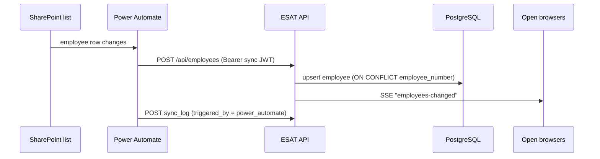

# 7. Integrations & Sync

ESAT integrates with three external services: **Microsoft (SharePoint + Power
Automate)** for employee data, **Cloudinary** for image/document storage, and
**Resend** for email.

## Employee sync (SharePoint → Power Automate → ESAT)

**How it actually works today:**

- **Direction:** push. Power Automate calls the ESAT **REST API** — it never
  connects to the database directly.
- **Auth:** as the **`sync@egypro.com`** account, using a **long-lived JWT** stored
  in the flow's HTTP action `Authorization: Bearer …` header (non-expiring, exempt
  from post-deploy token invalidation).
- **Upsert:** `POST /api/employees` inserts or updates keyed on
  `employee_number`.
- **Run log:** a `sync_log` row records each run (`triggered_by`,
  default `power_automate`); the latest run is queryable.

> ⚠️ The README's "Step 4 — SharePoint Sync" (Azure AD app registration + a
> `sync.js` Microsoft Graph pull + `SHAREPOINT_*` env vars) describes an **earlier
> design that is not in production** — the live backend has no `sync.js` and no
> `SHAREPOINT_*` variables.

### Exit handling (cascade)

When an employee's `employment_status` becomes `exit` — via the sync
(`POST /api/employees`) or an admin (`PUT /api/employees/:id/status`) — the app
cascades so exited people don't linger as actionable work:

- open **PPE requests** → `exit`
- open **NCR items** → `exit`

The same applies to casuals on `PUT /api/casuals/:id/status`. `exit` is kept
**distinct from `canceled`** (see [Data Model & Statuses](05-data-model-and-statuses.md)).

### Live updates (SSE)

Whenever employee data changes, the API pushes an event on `/api/events`; open
SPA sessions refresh instead of polling. (EventSource can't set headers, so the
token is passed as a query param there.)

## Cloudinary (image & document storage)

- Audit photos / documents are uploaded via `multer` and stored in **Cloudinary**;
  the resulting URL is saved against the audit.
- Config via `CLOUDINARY_CLOUD_NAME`, `CLOUDINARY_API_KEY`,
  `CLOUDINARY_API_SECRET` (environment only).

## Resend (email)

- **SCM digest** and **PM digest** — scheduled summaries of pending/ordered items
  to the relevant owners (`scheduleDailyDigest()` runs on server start).
- Transactional notifications on certain request events.
- Config via `RESEND_API_KEY` (environment only).

## Future: ETMS → ESAT consolidation

There is an open idea to move **ETMS** (the external source currently feeding
employee data) natively into ESAT. If that happens, the SharePoint/Power Automate
sync — and the `sync@egypro.com` long-lived token — would be **retired**, which
also removes the "rotating `JWT_SECRET` breaks the sync" dependency noted in
[`../SECURITY.md`](../SECURITY.md). Until then, treat the sync token as a
first-class dependency during any secret rotation.

## Operational note

Rotating secrets affects these integrations differently:

| Secret | Sync | Cloudinary | Resend |
|--------|------|-----------|--------|
| `DATABASE_URL` | no effect | no effect | no effect |
| `JWT_SECRET` | **breaks sync** until token re-minted | no effect | no effect |
| Cloudinary keys | no effect | update needed | no effect |
| `RESEND_API_KEY` | no effect | no effect | update needed |

Full procedure: [`../SECURITY.md`](../SECURITY.md).
